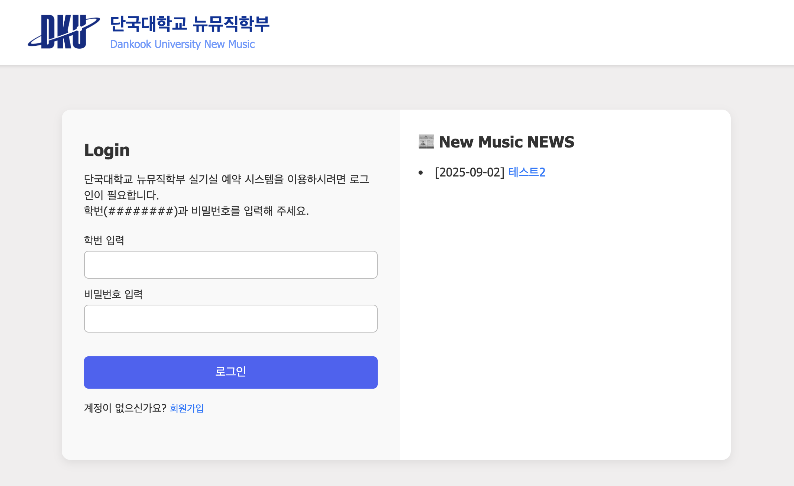
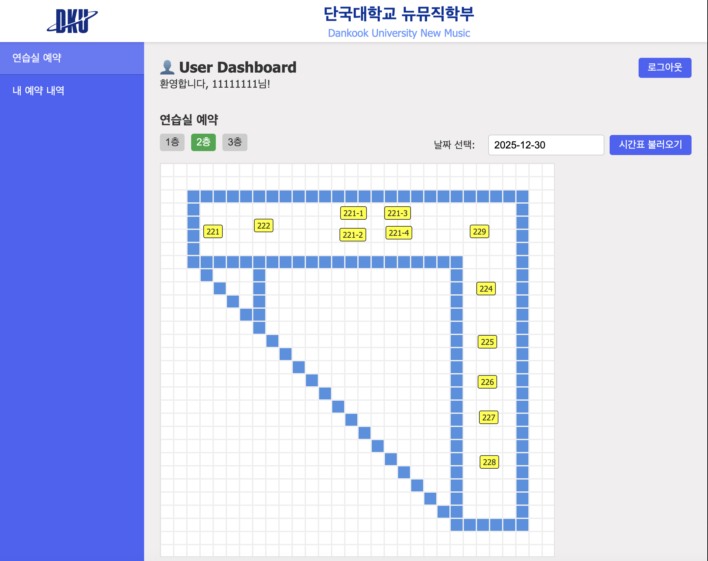
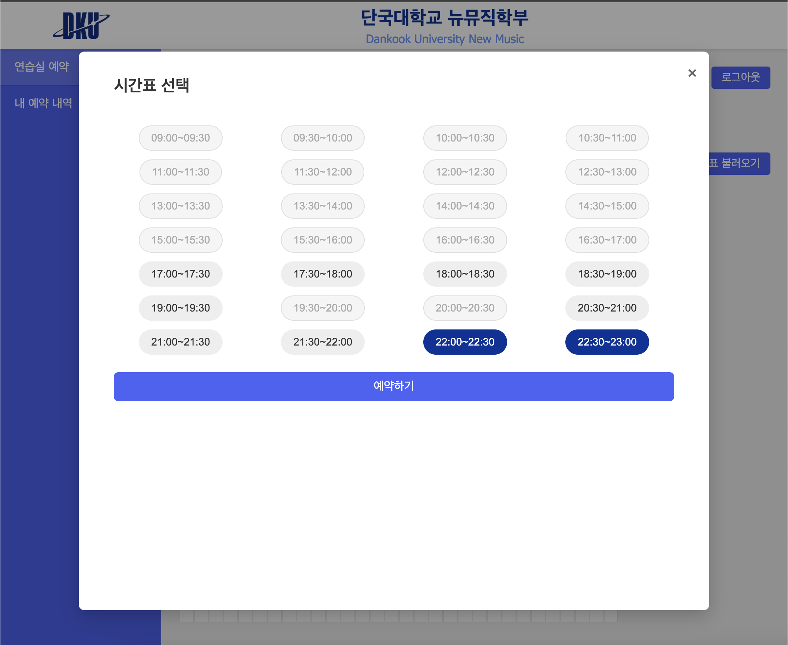
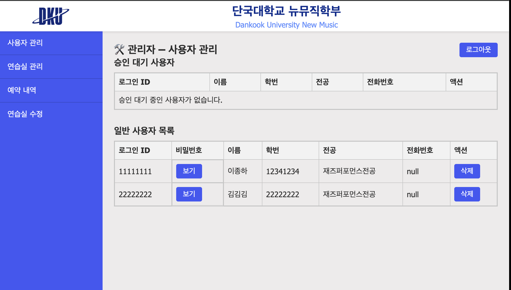
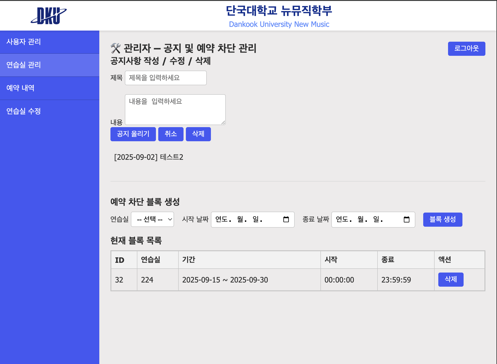
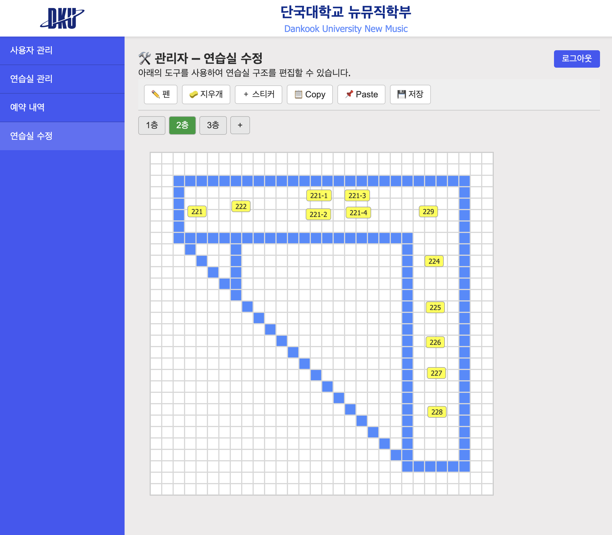

# 단국대학교 뉴뮤직 학부 연습실 예약 시스템

## 📌 프로젝트 개요

단국대학교 뉴뮤직 학부 학생들이 연습실 예약 및 장비 관리, 공지사항을 활용할 수 있도록 하는 웹사이트 프로젝트입니다.

## 🎯 프로젝트 목표

* 학생들의 연습실 예약 편의성 향상
* 연습실 별 장비 정보 제공
* 공지사항 접근성 개선
* 효율적인 관리자 시스템 구축 (학생 승인, 사용자 관리, 호실 관리)

## 🖥️ 화면 구성 (Screenshots)

### 👤 사용자 화면 (Student)

| 화면 | 설명 |
|------|------|
|  | 로그인 화면 |
|  | 사용자 메인 화면 (연습실 예약 현황 조회) |
|  | 연습실 예약 화면 (시간 선택 및 예약) |

---

### 🛠️ 관리자 화면 (Admin)

| 화면 | 설명 |
|------|------|
|  | 사용자 관리 (승인 대기 / 일반 사용자 목록) |
|  | 연습실 관리 및 공지사항 등록 |
|  | 연습실 UI 직접 설정 화면 (호실 배치 및 상태 관리) |

## 📦 주요 기능

### 사용자 기능

* **회원가입 및 로그인** (JWT 기반 인증)
* **연습실 예약**

  * 주 단위 예약 시스템 (매주 금요일 오전 9시 오픈)
  * 한 시간 단위 예약 (최대 연속 2시간)
  * 예약 중복 방지 및 시간 충돌 확인
* **예약 내역 조회 및 취소** (예약 10분 전까지 가능)
* **연습실 장비 리스트 조회**
* **공지사항 조회**

### 관리자 기능

* **사용자 관리**

  * 뉴뮤직 학부 인증 및 회원가입 승인
  * 사용자 상세정보 조회 및 삭제
* **호실 관리**

  * 예약 가능 여부 설정 (공사 등)
  * 예약 내역 확인 및 관리
  * 호실 이름 및 장비 리스트 관리
* **공지사항 관리** (게시물 작성 및 수정)

## 🛠️ 기술 스택

* **프론트엔드**: HTML/CSS/JavaScript
* **백엔드**: FastAPI
* **데이터베이스**: MySQL
* **배포 환경**: Cloudtype(AWS EC2로 변경 예정)

## 📌 사용자 정보

### 학생

* 제공 정보: 학번, 이름, 전공, 전화번호, 아이디, 비밀번호

### 관리자 (교수 또는 학생회)

* 승인 요청 시 학생 제공 정보 검토 및 승인 처리

## 🔒 로그인 및 보안

* JWT 기반 인증 방식
* 매일 오전 6시 전체 자동 로그아웃
* 장시간 로그인 유지 (Refresh Token: 1일)

## 📅 예약 정책

* 예약 가능 시간: 오전 9시 \~ 오후 11시
* 한 시간 단위 예약, 최대 2시간 연속 예약 가능
* 예약 취소는 시작 시간 기준 10분 전까지 가능
* 동일 시간대 중복 예약 방지

## 🔧 향후 유지보수 및 개선사항

* 공지사항 첨부파일 기능 추가
* DB 용량 관리 및 백업 시스템 구축
* 관리자용 전체 예약 기록 삭제 기능
* 토큰 유효기간 조정 및 관리

## 📁 프로젝트 GitHub 저장소

* [NM 프로젝트 GitHub 저장소](https://github.com/LeeBellHa/WebProejct)

cd backend
./.venv/bin/python -m uvicorn app.main:app --reload 
