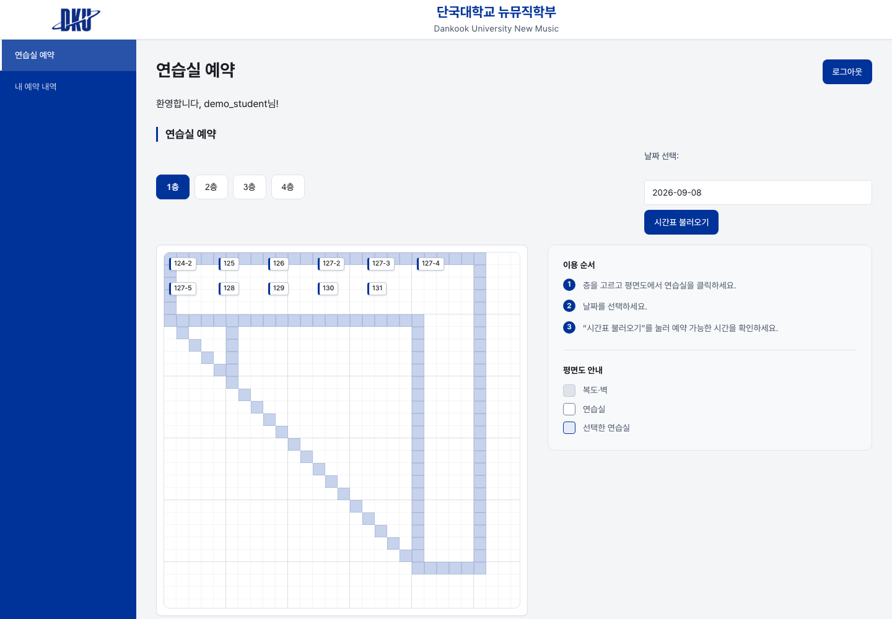
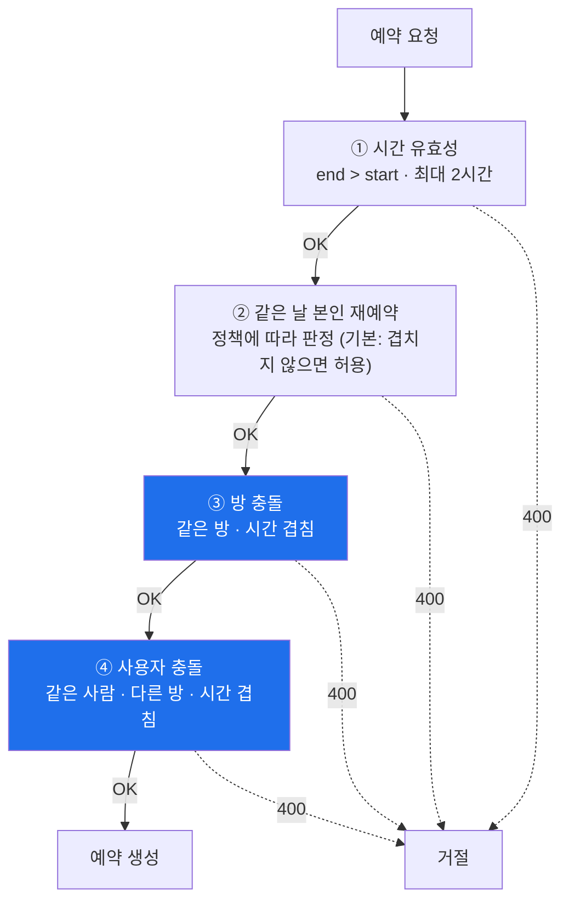
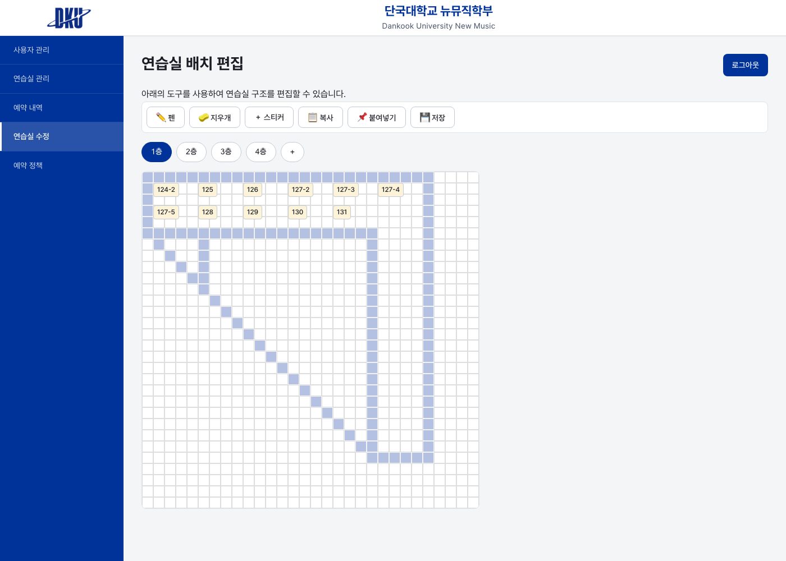
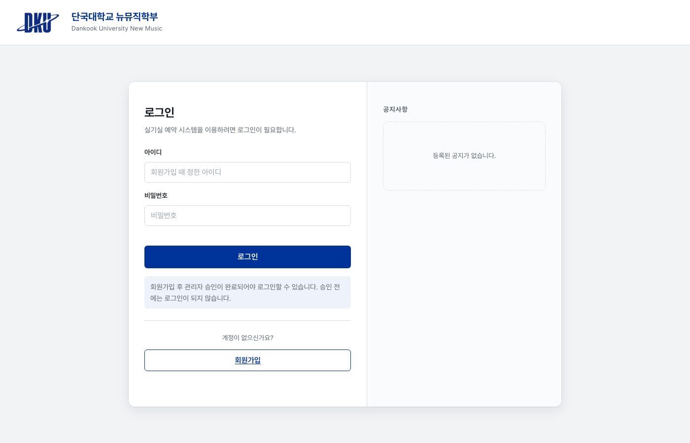
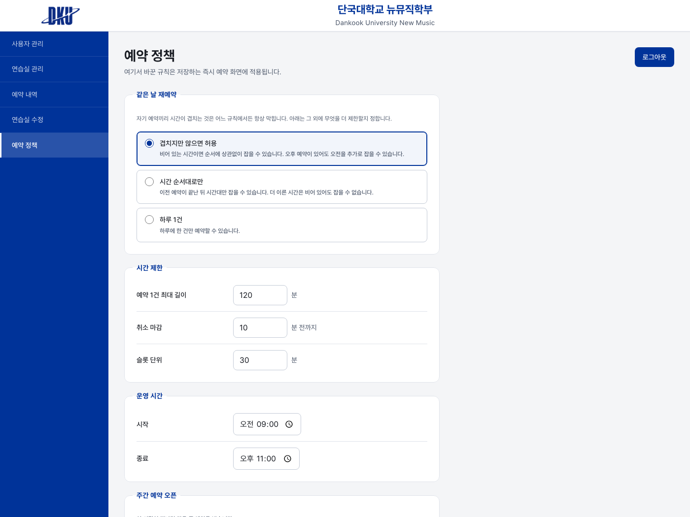

<div align="center">

# 뉴뮤직 연습실 예약 시스템

**단국대학교 뉴뮤직 학부 연습실 예약·관리 웹 서비스 — 학부 학생들이 실제로 사용 중**

[](https://fastapi.tiangolo.com/)
[](https://neon.tech/)
[](https://jwt.io/)
[](https://www.docker.com/)
[]()

2인 팀 · 2025.03 ~ 2026.07 · 실운영 서비스

</div>

---

## 한눈에 보기

| | |
|---|---|
| **문제** | 연습실 예약을 카톡·구두로 하다 보니 중복 예약과 분쟁이 반복됐다 |
| **핵심 난이도** | **예약 시스템의 본질은 UI가 아니라 "겹치면 안 되는 규칙"이다.** 같은 방·같은 사람·같은 날에 걸리는 조건이 서로 다르다 |
| **설계 포인트** | ① 4중 예약 검증 ② 격자 좌표 기반 호실 배치 ③ 학부 인증 승인 흐름 |
| **사용자** | 뉴뮤직 학부 학생 · 관리자(교수/학생회) |

<div align="center">

<br><sub>학생 예약 화면 — 관리자가 그린 평면도에서 방을 고른다</sub>
<br><sub>예약 현황 · 시간 선택 · 관리자 호실 배치 설정</sub>
</div>

---

## 목차

1. [담당 역할](#1-담당-역할)
2. [예약 충돌 처리 — 이 프로젝트의 핵심](#2-예약-충돌-처리--이-프로젝트의-핵심)
3. [격자 좌표 기반 호실 배치](#3-격자-좌표-기반-호실-배치)
4. [인증과 학부 승인 흐름](#4-인증과-학부-승인-흐름)
5. [기능](#5-기능)
6. [기술 스택 · 구조](#6-기술-스택--구조)
7. [실행 방법](#7-실행-방법)
8. [알려진 한계와 다음 단계](#8-알려진-한계와-다음-단계)

---

## 1. 담당 역할

2인 팀으로 진행했으며 전체 57 커밋 중 34 커밋을 담당했다.

| | 담당 |
|---|---|
| **이종하** | **백엔드 전반** — 예약 검증 로직, DB 스키마, JWT 인증·권한, 관리자 API, Docker 배포 |
| 팀원 | 프론트엔드 화면 구현 |
| 공통 | 예약 정책 설계, 운영 대응 |

---

## 2. 예약 충돌 처리 — 이 프로젝트의 핵심

예약 시스템에서 실제로 어려운 건 화면이 아니라 **"어떤 예약을 거절해야 하는가"** 다. 조건이 하나가 아니다.

`POST /bookings` 는 통과하기 전에 **4단계 검증**을 거친다.



### ③ 방 충돌 — 구간 겹침 판정

시간대가 "겹친다"를 정확히 판정하는 조건이다.

```python
Booking.room_id    == room_id,
Booking.start_date == start_date,
Booking.start_time <  end_time,      # 기존 시작 < 신규 종료
Booking.end_time   >  start_time     # 기존 종료 > 신규 시작
```

두 구간이 겹치는 필요충분조건이다. 시작 시각만 비교하면 **기존 예약을 감싸는 요청**(09:00–11:00 위에 08:00–12:00)을 놓치고, 포함 관계만 보면 **부분 겹침**을 놓친다. 양쪽 부등식을 모두 걸어야 걸러진다.

### ④ 사용자 충돌 — 놓치기 쉬운 조건

③만으로는 **한 사람이 같은 시간에 여러 연습실을 잡는 것**을 막지 못한다. 방이 다르므로 ③에는 걸리지 않는다.

```python
Booking.user_id  == current_user.user_id,
Booking.room_id  != room_id,          # 다른 방인데
Booking.start_time < end_time,        # 시간은 겹친다
Booking.end_time   > start_time
```

연습실이 한정된 상황에서 한 명이 여러 방을 선점하면 다른 학생이 쓸 수 없다. **운영상 실제로 발생했던 문제**라 별도 조건으로 분리했다.

### 타임존을 명시적으로 고정

```python
seoul_tz = ZoneInfo("Asia/Seoul")
now      = datetime.now(seoul_tz)
dt_start = datetime.combine(start_date, start_time, tzinfo=seoul_tz)
```

배포 서버의 시스템 시간대는 UTC인 경우가 많다. 날짜와 시각을 따로 저장한 뒤 비교할 때 타임존을 붙이지 않으면 **9시간이 어긋나 자정 근처 예약이 전날로 처리**된다. 모든 시각 비교에서 `Asia/Seoul`을 명시했다.

### 취소 규칙

```
이미 시작된 예약        → 취소 불가
시작 10분 전 이내       → 취소 불가
본인 예약이 아닌 경우    → 403
```

취소 마감을 둔 이유는, 직전 취소가 반복되면 그 시간을 아무도 쓸 수 없기 때문이다.

---

## 3. 격자 좌표 기반 호실 배치

연습실 평면도를 코드에 하드코딩하지 않았다. `cells` 테이블에 **층과 좌표**로 저장한다.

```
cells
  id · floor · x · y
```

관리자가 화면에서 칸을 배치하면 그 좌표가 DB에 저장되고, 사용자 화면은 이 좌표를 읽어 평면도를 그린다.

**이렇게 한 이유**: 연습실은 공사·용도 변경으로 배치가 바뀐다. 하드코딩하면 그때마다 코드를 고치고 재배포해야 한다. 좌표를 데이터로 두면 **관리자가 직접 바꿀 수 있다.** 층 개념도 `floor` 컬럼 하나로 확장된다.

<div align="center">

<br><sub>관리자 배치 편집 — 펜으로 복도를 그리고 방 이름표를 얹는다</sub>
<br><sub>관리자 호실 배치 설정 화면</sub>
</div>

---

## 4. 인증과 학부 승인 흐름

이 서비스는 **뉴뮤직 학부 학생만** 쓸 수 있어야 한다. 학교 계정 연동이 없으므로 승인 절차를 두었다.

```
회원가입  →  role = "pending"  →  로그인 차단
                    ↓
           관리자가 학번·이름·전공 확인
                    ↓
              role = "user"  →  로그인 허용
```

`users.role`을 `pending` / `user` / `admin` **enum**으로 두고 기본값을 `pending`으로 설정했다. 별도 승인 테이블 없이 역할 하나로 가입 심사와 권한 관리를 함께 처리한다.

**토큰 정책**
- JWT (HS256), payload에 `user_id` · `role` 포함
- Refresh Token 1일 — 학생들이 매번 로그인하지 않도록
- 매일 오전 6시 전체 자동 로그아웃 — 공용 PC에서 로그인이 남는 것을 방지
- 서명키는 환경변수로만. 미설정이면 서버가 뜨지 않는다

### 비밀번호 저장 — 평문에서 bcrypt로

운영 중에 발견한 문제다. 비밀번호가 해싱 없이 저장되고 로그인이 평문을 직접 비교하고 있었다. 응답 스키마에도 `password`가 들어 있어 API로 나갔고, 관리자 화면에는 그것을 그대로 보여주는 버튼까지 있었다. 저장·전송·표시 세 단계가 모두 평문이었다.

이미 쓰는 사람이 있는 서비스라 한 번에 갈아엎을 수 없어 **점진 전환**으로 갔다.

```
로그인 시 저장값이 bcrypt 해시가 아니면
  → 평문으로 비교해 인증하고, 성공 즉시 bcrypt로 다시 저장
```

학생은 아무것도 하지 않아도 다음 로그인 한 번으로 전환된다.

해시로 바꾸면 관리자도 남의 비밀번호를 알 수 없다. 그래서 비밀번호를 잊은 학생을 도울 경로가 필요했다. `PATCH /users/{id}/reset-password`가 임시 비밀번호를 발급한다. 평문은 그 응답에서 **한 번만** 나가고 DB에는 해시만 남는다. 관리자 화면의 "보기" 버튼은 "초기화"로 바뀌었다.

---

## 4-1. 화면

<div align="center">

<br><sub>로그인 — 가입 후 관리자 승인이 필요하다는 안내를 미리 보여준다</sub>
<br><br>

<br><sub>예약 정책 — 규칙마다 실제로 무엇이 달라지는지 한 줄씩 적었다. 저장하면 즉시 예약 화면에 적용된다</sub>
</div>

---

## 5. 기능

### 학생

| | |
|---|---|
| 예약 | 주 단위 오픈(매주 금요일 09:00) · 1시간 단위 · **최대 2시간 연속** |
| 예약 시간 | 09:00 ~ 23:00 |
| 조회·취소 | 본인 예약 내역, 시작 10분 전까지 취소 |
| 정보 | 연습실별 장비 목록, 공지사항 |

### 관리자

| | |
|---|---|
| 사용자 | 학부 인증 승인(`pending` → `user`), 상세 조회, 삭제 |
| 호실 | 예약 가능 여부(공사 등), 이름·장비 관리, **격자 배치 편집** |
| 예약 | 전체 예약 내역 조회·관리 |
| 공지 | 게시물 작성·수정 |

---

## 6. 기술 스택 · 구조

| | |
|---|---|
| Backend | **FastAPI** · SQLAlchemy · PostgreSQL (Neon) |
| Auth | JWT (HS256) · Refresh Token |
| Frontend | HTML / CSS / Vanilla JS (프레임워크 없음) |
| 배포 | Docker · Cloudtype |

```
├── backend/app/
│   ├── models/       user · room · cell · booking · notice
│   ├── routers/      auth · user · room · cell · booking · admin_booking · notice · health
│   ├── schemas/      Pydantic 요청·응답
│   ├── database.py · main.py
│   └── .env.example
├── frontend/
│   ├── index.html                    로그인 · 예약
│   ├── admin_booking.html            예약 관리
│   ├── admin_booking_list.html       예약 내역
│   ├── admin_making_room.html        호실 배치 편집
│   ├── admin_userlist.html           사용자 승인·관리
│   ├── js/   main · user · admin · register · consent-modal
│   └── css/  common · user · admin · consent-modal
└── Dockerfile
```

프론트엔드는 프레임워크 없이 순수 JS로 구성했다. 페이지 수가 적고 상태가 단순해 빌드 파이프라인을 두는 이득이 크지 않다고 판단했다.

---

## 7. 실행 방법

**Docker (권장)**
```bash
cp backend/.env.example backend/.env    # DATABASE_URL, JWT_SECRET 채우기
docker compose up --build -d
```

**직접 실행**
```bash
cd backend
python3 -m venv .venv && ./.venv/bin/pip install -r requirements.txt
cp .env.example .env
./.venv/bin/python -m uvicorn app.main:app --reload
```

화면 `http://localhost:8000` · API 문서 `http://localhost:8000/docs`

### 둘러보기용 계정

비밀번호는 전부 `demo1234!` 입니다.

| 아이디 | 역할 | 무엇을 볼 수 있나 |
|---|---|---|
| `demo_admin` | 관리자 | 사용자 승인, 연습실 배치 편집, 전체 예약 내역, **예약 정책** |
| `demo_student` | 학생 | 평면도에서 방을 골라 예약, 내 예약 취소 |
| `demo_pending` | 승인 대기 | 로그인이 막히는 화면. 가입 후 관리자 승인 전 상태 |

`demo_pending`으로 로그인을 시도하면 403과 함께 안내가 뜹니다. 관리자 화면의 "승인 대기" 목록에서 이 계정을 승인하면 그때부터 로그인됩니다. 가입부터 승인까지의 흐름을 한 번에 볼 수 있습니다.

### 테스트

```bash
cd backend && ./.venv/bin/python -m pytest -v
```

---

## 8. 알려진 한계와 다음 단계

**동시성 — 해결함**

예약 생성은 `SELECT`(충돌 검사) → `INSERT`(생성) 순서라, 두 요청이 같은 순간에 같은 시간대를 요청하면 둘 다 검사를 통과한 뒤 둘 다 삽입될 수 있었다. 주 단위 오픈(금요일 09:00)에 요청이 몰리는 구조라 실제로 터질 수 있는 문제였다.

처음엔 `(room_id, start_date, start_time)` **유니크 제약**을 생각했는데, 검증해 보니 이 스키마에서는 부족했다. 예약 길이가 1~2시간 가변이라 `09:00-11:00`과 `10:00-12:00`은 `start_time`이 달라 제약에 걸리지 않으면서 시간은 겹친다.

`SELECT ... FOR UPDATE`도 단독으로는 안 된다. **존재하는 행만 잠그기** 때문에, 겹치는 기존 예약이 아직 없는 상황 — 오픈 직후, 레이스가 가장 많이 터지는 바로 그 순간 — 에는 잠글 대상이 없어 두 트랜잭션 다 통과한다.

그래서 **`pg_advisory_xact_lock`** 으로 갔다.

```python
lock_room_date(db, room_id, start_date)   # 키: (-room_id, date.toordinal())
lock_user_date(db, user_id, start_date)   # 키: ( user_id, date.toordinal())
```

- 방은 음수, 사용자는 양수로 키 공간을 나눠 충돌을 없앴다. `toordinal()`은 전단사라 날짜 간 해시 충돌이 원리적으로 없다
- 획득 순서를 방 → 사용자로 고정해 데드락 사이클을 막았다
- 세션 레벨이 아니라 **트랜잭션 레벨**이어야 한다. Neon의 커넥션 풀러가 PgBouncer transaction 모드라, 세션 락은 다른 커넥션에서 풀리거나 락을 쥔 채 반환될 수 있다

**검증**: 8명이 같은 슬롯을 동시에 요청 → 1건만 201, 나머지 7건 400. DB에도 1행.

**예약 정책을 코드에서 DB로**

최대 예약 시간, 취소 마감, 운영 시간, 슬롯 단위, 주간 오픈 시점이 코드에 박혀 있어 규칙 하나 바꾸려면 재배포해야 했다. 평면도 좌표를 `cells` 테이블에 둔 것과 같은 이유로 `booking_policies` 테이블로 옮기고 관리자 화면을 붙였다.

같은 날 재예약 규칙도 고를 수 있게 했다.

| 값 | 동작 |
|---|---|
| `NO_OVERLAP` (기본) | 겹치지만 않으면 순서 무관 |
| `SEQUENTIAL` | 이전 예약 종료 이후 시간대만 |
| `ONE_PER_DAY` | 하루 1건 |

원래 코드는 `SEQUENTIAL`을 의도했는데 비교 대상이 새 예약 시각이 아니라 **현재 시각**이었다. 그래서 같은 사용자의 그날 두 번째 예약이 시간대와 무관하게 전부 막혔고, ④(한 사람이 같은 시간에 여러 방)는 ②에 가려 실행조차 되지 않았다. 비교 대상을 바로잡고 규칙을 선택 가능하게 했다.

**테스트**

`pytest` 26건. 겹침 판정 9케이스, `same_day_mode` 3종, 취소 규칙 6종, 정책 반영, 관리자 권한.
정책 테스트는 값을 바꾼 뒤 동작이 실제로 갈리는지를 본다. 나중에 누가 하드코딩 상수로 되돌리면 여기서 잡힌다.

```bash
cd backend && ./.venv_pg/bin/python -m pytest -v
```

**그 외 예정**
- 공지사항 첨부파일
- DB 백업 체계
- 관리자용 예약 기록 일괄 삭제
- 과거 시각 예약을 막는 검증 (현재는 지난 날짜도 등록된다)

---

<div align="center">

**이종하** · [GitHub](https://github.com/bell-ha) · [Portfolio](https://bell-ha.github.io)

</div>
