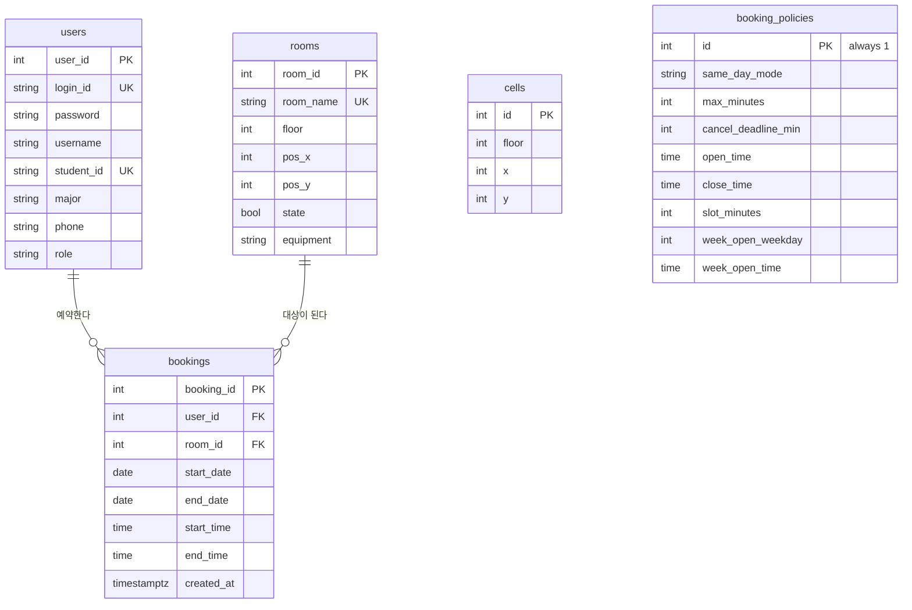

# 데이터베이스 설계

연습실 예약 시스템의 스키마, 무결성 제약, 동시성 제어를 정리한다. 대상 DB는
PostgreSQL(Neon), ORM은 SQLAlchemy다. 아래 스키마·제약·실험 결과는 전부
`docs/` 작성 시점에 스크래치 Postgres(운영과 동일 스키마, 운영 데이터는 없음)에서
직접 재현해 확인한 것이다.

## 1. 설계 동기 — 왜 평면도가 데이터인가

연습실을 목록(방 번호 나열)으로 보여주면 "124-2가 어디 있는지"가 번호만으로는
안 잡힌다. 그래서 평면도로 보여줘야 하는데, 평면도를 이미지 한 장으로
넣으면 공사나 용도 변경이 있을 때마다 이미지를 새로 만들고 좌표를 코드에
다시 박아 재배포해야 한다 — 배치가 바뀌는 주체(운영진)와 그걸 반영하는
주체(개발자)가 분리된다.

그래서 평면도를 그리는 데 필요한 좌표 자체를 데이터로 뒀다. `cells(floor,
x, y)`는 복도·벽이 차지하는 칸의 좌표, `rooms.pos_x/pos_y`는 방 이름표를
놓을 좌표다. 관리자 화면에서 칸을 찍고 이름표를 얹으면 그 값이 그대로 이
두 테이블에 저장되고, 학생이 보는 화면은 그 데이터를 읽어 평면도를 그린다.
개발자를 거치지 않고 운영진이 직접 배치를 바꿀 수 있다.

**같은 원칙이 `booking_policies`에도 있다.** 예약 1건의 최대 길이, 취소
마감, 운영 시간, 주간 오픈 시점 — 전부 원래 코드에 상수로 박혀 있던
값인데 DB로 옮겼다(3번 표의 `booking_policies` 행). 이유가 같다: 이 값들을 실제로 바꿔야 하는 사람은
운영진(학과 사무실)이지 개발자가 아니다.

정리하면 이 스키마의 원칙은 하나다 — **현업이 직접 바꿔야 하는 값은 코드가
아니라 데이터에 둔다.** 아래 테이블 설계·제약은 전부 이 원칙이 구체적인
컬럼·제약으로 나타난 결과다.

## 2. ERD



`cells`는 `users`/`rooms`/`bookings`와 FK로 연결돼 있지 않다. 3번에서 이유를 설명한다.

## 3. 테이블 설계

| 테이블 | 역할 |
|---|---|
| `users` | 계정. `role`(pending/user/admin)로 가입 심사와 권한을 함께 처리한다. |
| `rooms` | 연습실 목록. `pos_x`/`pos_y`는 평면도 위에 이름표(스티커)를 그릴 좌표다. |
| `cells` | 평면도의 칸(복도·벽) 좌표. `rooms`와 별개다. |
| `bookings` | 예약. `users`·`rooms`를 FK로 참조한다. |
| `booking_policies` | 예약 운영 규칙. 단일 행(`id=1`)만 존재한다. |

### `cells`가 별도 테이블인 이유

1번(설계 동기)에서 다룬 "평면도를 데이터로 둔다"는 판단이 구체적으로
`cells`와 `rooms.pos_x/pos_y` 두 컬럼 집합으로 나타난다. 여기서는 그 둘이
왜 같은 테이블이 아닌지만 짚는다.

`rooms.pos_x/pos_y`(이름표 위치)와 `cells.(x,y)`(칸 채움)는 서로 다른 좌표
데이터다. 이름표는 방 하나당 하나지만, 칸은 방의 실제 면적만큼 여러 개가
필요해서 같은 테이블에 둘 수 없다. 그래서 `cells`는 `rooms`를 FK로 참조하지
않고 순수 좌표 집합으로만 존재한다 — 어떤 칸이 "몇 번 방의 칸"인지는 DB가
알지 못하고, 프런트가 좌표가 겹치는 걸 보고 판단한다. 방과 칸을 연결하는 FK가
없다는 게 이 설계의 한계이기도 하다(7번).

### FK와 ORM cascade

```
bookings_user_id_fkey  FOREIGN KEY (user_id) REFERENCES users(user_id)
bookings_room_id_fkey  FOREIGN KEY (room_id) REFERENCES rooms(room_id)
```

DB에 걸린 FK 자체에는 `ON DELETE CASCADE`가 없다. `User.bookings`/`Room.bookings`
관계에 `cascade="all, delete-orphan"`이 있는데, 이건 SQLAlchemy ORM 레벨
동작이다 — ORM 세션으로 사용자를 지우면 SQLAlchemy가 그 사용자의 예약을 먼저
지우고 나서 사용자를 지운다. 원시 SQL(`DELETE FROM users ...`)로 지우면 이
cascade는 적용되지 않고 FK 위반으로 막힌다.

## 4. 무결성 제약

```sql
-- bookings
CHECK (end_time > start_time)          -- ck_bookings_time_order
CHECK (end_date >= start_date)         -- ck_bookings_date_order
DEFAULT now()                          -- created_at
INDEX (room_id, start_date)            -- ix_bookings_room_date
INDEX (user_id, start_date)            -- ix_bookings_user_date

-- cells
UNIQUE (floor, x, y)                   -- uq_cells_floor_x_y

-- booking_policies
CHECK (id = 1)                                              -- ck_policy_singleton
CHECK (close_time > open_time)                               -- ck_policy_open_before_close
CHECK (max_minutes > 0)                                       -- ck_policy_max_minutes
CHECK (slot_minutes > 0)                                      -- ck_policy_slot_minutes
CHECK (cancel_deadline_min >= 0)                              -- ck_policy_cancel_deadline
CHECK (week_open_weekday BETWEEN 0 AND 6)                     -- ck_policy_weekday_range
CHECK (same_day_mode IN ('NO_OVERLAP','SEQUENTIAL','ONE_PER_DAY'))  -- ck_policy_same_day_mode
```

논지: 업무 규칙이 API 코드에만 있으면, API를 거치지 않는 경로(운영자의 psql,
배치 스크립트, 검증을 빠뜨린 새 엔드포인트)로 모순된 행이 그대로 들어간다.
검증은 요청을 막는 것이고 제약은 데이터를 지키는 것이라 둘은 다른 층위다.

아래는 위 제약을 스크래치 DB에 실제로 적용한 뒤, 각각을 원시 SQL로 직접
위반해 본 결과다(`psql`, ORM을 거치지 않음).

| 시도 | 결과 |
|---|---|
| `start_time='15:00', end_time='13:00'`으로 INSERT | `ERROR: ... violates check constraint "ck_bookings_time_order"` |
| `start_date='2026-01-02', end_date='2026-01-01'`로 INSERT | `ERROR: ... violates check constraint "ck_bookings_date_order"` |
| 같은 `(floor,x,y)`로 `cells` 두 번 INSERT | `ERROR: ... violates unique constraint "uq_cells_floor_x_y"` |
| `booking_policies`에 `id=2`로 INSERT | `ERROR: ... violates check constraint "ck_policy_singleton"` |
| `same_day_mode='BOGUS'`로 INSERT | `ERROR: ... violates check constraint "ck_policy_same_day_mode"` |
| `created_at` 컬럼을 생략하고 `bookings` INSERT | 성공, `created_at`이 `now()`로 채워짐 |

`created_at`은 원래 SQLAlchemy 쪽 `default=datetime.utcnow`만 있었다. 이건
ORM이 INSERT 문을 만들 때 채워주는 값이라, ORM을 거치지 않는 INSERT는
`created_at`이 없어 NOT NULL 위반으로 실패했다. `server_default=func.now()`로
바꿔 DB 자체가 채우게 했다 — 위 표의 마지막 행이 그 확인이다. `rooms.state`도
같은 문제가 있다(Python 쪽 `default=True`만 있고 `server_default`가 없다) —
아직 고치지 않았고 7번에 남겨 둔다.

## 5. 동시성 제어

### 5.1 문제 — 갱신 손실

예약 생성은 "겹치는 예약이 있는지 SELECT로 확인 → 없으면 INSERT" 순서로
동작한다. 이 두 문장 사이에 아무 잠금도 없으면, 정확히 같은 시간대를 요청하는
두 트랜잭션이 둘 다 SELECT를 통과한 뒤 둘 다 INSERT에 성공할 수 있다 — 고전적인
lost update다. 이 시스템은 매주 금요일 09:00에 예약이 열려 요청이 그 순간에
몰리므로 실제로 일어날 수 있는 시나리오였다.

### 5.2 검토 1 — 복합 유니크 제약

`UNIQUE(room_id, start_date, start_time)`을 먼저 검토했다. 두 번째 INSERT가
그 자리에서 실패하니 단순하고 확실해 보인다.

기각한 이유: 예약 길이가 1~2시간으로 가변이다. `09:00-11:00`이 이미 있는데
`10:00-12:00`이 들어오면 두 요청은 실제로 겹치지만 `start_time`이
09:00과 10:00으로 서로 달라 유니크 제약에 걸리지 않는다. **겹침은 구간
비교로만 판정되는데, 유니크 제약은 정확히 같은 키만 잡아낸다** — 이 문제는
키로 표현할 수 없다. (예약을 30분 단위 원자적 슬롯 행으로 쪼개 슬롯마다
유니크 제약을 걸면 해결되지만, 스키마를 바꿔야 해서 채택하지 않았다.)

### 5.3 검토 2 — `SELECT ... FOR UPDATE`

같은 방·날짜의 기존 예약 행을 잠그고 검사하는 방법을 검토했다.

기각한 이유: `FOR UPDATE`는 **존재하는 행만** 잠근다. 그 시간대에 예약이
하나도 없는 상태(오픈 직후 첫 요청들이 몰리는 바로 그 상황)에는 잠글 행
자체가 없다. 두 트랜잭션이 동시에 "겹치는 행 없음"을 보고 둘 다 통과할 수
있다 — phantom read다. 존재를 가정한 잠금으로는 "아직 아무것도 없음"을
잠글 수 없다.

### 5.4 채택 — `pg_advisory_xact_lock`

행이 아니라 "이 방·이 날짜"라는 키 자체를 잠근다. 행의 존재 여부와 무관하게
같은 키를 요청하는 트랜잭션을 직렬화한다.

```python
def lock_room_date(db, room_id, on_date):
    db.execute(text("SELECT pg_advisory_xact_lock(:k1, :k2)"),
               {"k1": -room_id, "k2": on_date.toordinal()})

def lock_user_date(db, user_id, on_date):
    db.execute(text("SELECT pg_advisory_xact_lock(:k1, :k2)"),
               {"k1": user_id, "k2": on_date.toordinal()})
```

**키 설계.** `pg_advisory_xact_lock(int, int)`은 두 int32를 해시하지 않고
그대로 키로 쓴다. `date.toordinal()`은 0001-01-01~9999-12-31 범위에서
1~3,652,059로, int32 안에 안전하게 들어가고 날짜마다 값이 유일하다(전단사) —
그래서 해시 충돌을 고려할 필요가 없다. `room_id`는 항상 음수로, `user_id`는
항상 양수로 걸어 두 키 공간이 절대 겹치지 않게 했다(둘 다 자연수 PK라 0이
없다). `booking.py`(학생 예약)와 `admin_booking.py`(관리자 블록)가 이
헬퍼를 그대로 공유한다 — 두 파일이 각자 부호 규칙을 다르게 정하면 같은
`room_id`에 대해 서로 다른 키가 나와 상호 배제가 깨진다.

**락 획득 순서**는 항상 room → user로 고정한다. 두 락을 반대 순서로 거는
경로가 하나라도 있으면 데드락 사이클이 생길 수 있다.

**세션 레벨이 아니라 트랜잭션 레벨인 이유.** Neon의 연결 문자열은 PgBouncer
transaction-mode 풀러 엔드포인트(`-pooler`)다. transaction 모드에서는
트랜잭션이 끝날 때마다 물리 커넥션이 풀로 반환되고, 다음 요청이 같은
커넥션을 받는다는 보장이 없다. `pg_advisory_lock`(세션 레벨)은 "잠근
커넥션 = 나중에 푸는 커넥션"이 보장돼야 하는데 transaction 모드에서는 그
보장이 깨진다 — 잠갔다가 다음 statement가 다른 백엔드로 라우팅되면 락이
남의 커넥션에 묶이거나, 원래 커넥션이 락을 쥔 채 풀에 반환돼 다른 요청을
막을 수 있다. `pg_advisory_xact_lock`은 COMMIT/ROLLBACK 시 자동 해제되므로
이 문제가 구조적으로 없다.

**실증.** 같은 (방, 날짜, 겹치는 시간대)에 8명이 동시에 예약을 요청했을 때
1건만 성공했고, DB에도 1행만 남았다.

## 6. same_day_mode — 정책과 검증의 상호작용

`booking_policies.same_day_mode`는 세 값 중 하나다(3번의 CHECK로 강제).

| 값 | 규칙 |
|---|---|
| `NO_OVERLAP`(기본값) | 자기 예약끼리 겹치지만 않으면 순서 무관 |
| `SEQUENTIAL` | 새 예약은 그날 마지막(종료가 가장 늦은) 예약 종료 이후에만 |
| `ONE_PER_DAY` | 그날 이미 예약이 있으면 무조건 차단 |

`NO_OVERLAP`은 방 충돌·사용자 충돌(다른 방 동시 점유) 검사만 적용되고 순서
제약은 건너뛴다. `SEQUENTIAL`을 쓰면 수학적으로 흥미로운 결과가 생긴다 —
사용자 충돌 검사는 "새 예약이 사용자의 그날 최종 예약과 시간이 겹치는가"를
보는데, `SEQUENTIAL`이 이미 "새 예약 시작 ≥ 그날 최종 예약 종료"를 강제하므로
그 조건을 통과한 이상 사용자 충돌 검사는 정의상 항상 빈 결과를 반환한다
(그날 마지막 예약의 종료 시각이 그날 전체의 최댓값이라는 게 `SEQUENTIAL`
자체의 귀납적 불변식이기 때문이다). 즉 **`SEQUENTIAL` 모드에서는 사용자
충돌 검사가 도달 불가능한 코드가 된다** — `NO_OVERLAP`(기본값)에서만
실제로 동작한다. 정책을 바꿀 수 있게 설계했기 때문에 생긴, 코드만 보고는
바로 안 보이는 상호작용이다.

## 7. 남은 것

- **과거 예약 생성 차단 없음.** 예약 생성 시 `종료 > 시작`, `최대 길이`,
  `슬롯 정렬`은 검사하지만 "시작 시각이 미래여야 한다"는 검사가 없다. API로
  지난 날짜 예약을 만들 수 있다.
- **`rooms.state`에 `server_default` 없음.** `created_at`과 같은 문제가
  아직 남아 있다 — ORM을 거치지 않는 INSERT는 `state`가 없으면 NOT NULL
  위반으로 실패한다(3번 참고).
- **`cells`와 `rooms`가 FK로 연결되지 않는다.** 어떤 칸이 어느 방에
  속하는지 DB가 모른다 — 프런트가 좌표 겹침으로 추론한다. 방을 지워도
  칸은 안 지워지고, 그 반대도 검증되지 않는다.
- **관리자 블록(`admin_booking.py`)에는 슬롯 정렬 검사가 없다.** 공사·점검
  블록은 임의 시간이 필요할 수 있다고 보고 의도적으로 열어 뒀다.
