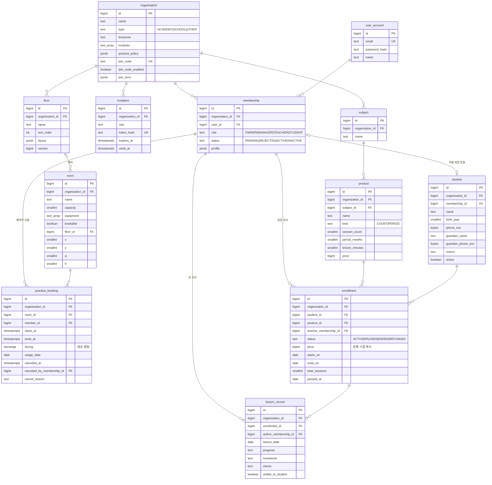

# ERD (MVP)

| 항목 | 내용 |
|---|---|
| 버전 | 0.2 |
| 작성일 | 2026-10-06 |
| 근거 | [요구사항 0.2](../requirements/01-요구사항-정의.md), [유스케이스](../requirements/02-유스케이스.md), [ADR](../adr/README.md) |
| DDL | [schema-draft.sql](schema-draft.sql) (테이블 12개) |

원칙: MVP 유스케이스가 실제로 읽거나 쓰는 테이블과 컬럼만 둔다. 조회 조건으로 쓰지 않는 설정은 jsonb 하나에 담는다.

## 1. 다이어그램



## 2. 결정과 이유

### 공통
| 결정 | 이유 |
|---|---|
| ID는 `bigint` + 테이블별 시퀀스(`INCREMENT BY 50`) | `IDENTITY`를 쓰면 Hibernate가 JDBC 일괄 INSERT를 못 한다. 최적화기는 `pooled-lo`로 둔다. 그래야 psql에서 `DEFAULT nextval`로 넣은 ID와 겹치지 않는다 |
| 기관 범위 테이블마다 `organization_id`, 외래 키는 단순 FK | 기관 격리는 애플리케이션 검사와 "다른 기관으로 접근하면 막힌다" 테스트로 지킨다 (ADR 0005, NFR-03) |
| 상태값은 `text` + `CHECK` | PostgreSQL enum은 값을 바꾸기 어렵다. JPA `@Enumerated(STRING)`과 그대로 맞는다 |
| 행을 지우는 곳은 레슨 기록뿐이다 | 예약은 `canceled_at`, 멤버는 `status`, 원생은 `active`로 끝낸다. 예약과 수강이 이 행들을 참조한다 |
| 연락처는 `bytea`에 AES-GCM 암호문 | NFR-04. 그래서 연락처로는 검색하지 않는다. 원생 검색은 이름으로 한다 |

> **CHECK와 NULL 함정:** `CHECK (A OR (kind = 'X' AND col > 0))`에서 `col`이 NULL이면 비교 결과가 NULL이 되고, PostgreSQL은 결과가 NULL인 CHECK를 통과시킨다. OR 분기에서 NULL일 수 있는 컬럼은 `IS NOT NULL`을 명시한다. 초안 검증 중 실제로 걸렸다.

### 기본 모듈
| 테이블 | 결정 | 이유 |
|---|---|---|
| organization | `modules text[]` | 켜진 모듈 목록만 있으면 된다. 별도 테이블로 둘 조회가 없다 |
| organization | `practice_policy jsonb` | 정책은 예약할 때 통째로 읽기만 하고 조회 조건으로 쓰지 않는다. 형식 검증은 애플리케이션의 정책 레코드 클래스가 한다. 모양은 아래 |
| organization | `join_code` 원문, `UNIQUE` | 관리자가 코드를 여러 번 다시 보고 알려야 한다. 코드로 얻는 것은 대기 상태뿐이고 승인이 따로 있다. 새로 만들면 덮어써서 이전 코드가 무효가 된다 |
| membership | 가입 신청도 이 테이블에 `status = PENDING`으로 둔다 | v1의 pending 방식과 같다. 신청 테이블을 따로 두면 승인할 때 행을 옮겨야 한다. `UNIQUE (organization_id, user_id)`가 "이미 멤버이거나 대기 중"(UC-06 2b)을 막는다. 거절된 사람이 다시 신청하면 같은 행을 `PENDING`으로 되돌린다 |
| membership | `profile jsonb` | 가입 때 받은 학번·전공 같은 값. 기관마다 항목이 다르다 (`organization.join_form`이 정의) |
| membership | 한 기관에서 역할은 하나 | 다른 기관에서는 다른 역할을 가질 수 있다 (요구사항 3절) |
| invitation | `token_hash`만 저장 | 링크 토큰은 비밀번호와 같은 수준으로 다룬다. 1회 사용은 `UPDATE ... SET used_at = now() WHERE id = ? AND used_at IS NULL AND expires_at > now()`로 처리하고, 갱신된 행이 0이면 거절한다 |

`practice_policy` 모양 (FR-PR-04):
```json
{
  "hours": { "MON": ["09:00", "23:00"], "TUE": ["09:00", "23:00"], "SUN": null },
  "slotMinutes": 30,
  "maxContinuousMinutes": 120,
  "dailyMaxMinutes": 180,
  "open": { "mode": "WEEKLY", "dayOfWeek": "FRI", "time": "09:00" },
  "cancelDeadlineMinutes": 10
}
```
`open`은 `{ "mode": "ROLLING", "days": 14 }`일 수도 있다. WEEKLY는 그 시각에 다음 주 월~일을 연다.

### 연습실 모듈
| 테이블 | 결정 | 이유 |
|---|---|---|
| floor | 벽·복도는 `layout jsonb` 하나 | ADR 0009. 층 전체를 한 번에 읽고 저장한다. 칸 하나를 따로 조회하지 않는다 |
| floor | `version` | 평면도 저장의 `If-Match`. `UPDATE ... SET version = version + 1 WHERE id = ? AND version = ?`가 0행이면 412 (UC-20 5a) |
| room | 위치는 컬럼(`floor_id, x, y, w, h`) | 예약이 방을 외래 키로 참조한다 (ADR 0009). 평면도에서 빼면 다섯 컬럼이 모두 NULL이다 |
| room | "한 칸에 방 하나", 격자 범위, 벽과의 겹침은 애플리케이션이 검증한다 | 평면도 저장은 관리자 한 명이 하고, 동시 편집은 `version`이 막는다. DB 제약까지 둘 동시성 문제가 아니다 |
| room | 앞으로 예약이 있는 방을 평면도에서 빼면 409로 거절한다 | UC-20 3a. 관리자가 예약을 먼저 취소한다 |

### practice_booking: 대표 문제 (ADR 0010)
```sql
during tstzrange GENERATED ALWAYS AS (tstzrange(starts_at, ends_at, '[)')) STORED,
CONSTRAINT ex_booking_room   EXCLUDE USING gist (room_id   WITH =, during WITH &&) WHERE (canceled_at IS NULL),  -- R1
CONSTRAINT ex_booking_member EXCLUDE USING gist (member_id WITH =, during WITH &&) WHERE (canceled_at IS NULL)   -- R2
```
| 결정 | 이유 |
|---|---|
| R1·R2를 배타 제약으로 둔다 | 애플리케이션 직렬화에 빠진 경로가 있어도 겹친 예약은 저장되지 않는다. 위반은 SQLSTATE `23P01`로 오고, 제약 이름으로 R1·R2를 구분해 409로 바꾼다 |
| `during`은 저장 생성 컬럼 | JPA는 `Instant` 두 개(`starts_at`, `ends_at`)만 다룬다. range 타입 매핑이 필요 없다 |
| 반열린 구간 `[)` | 16:00~17:00과 17:00~18:00은 겹치지 않는다 (UC-23) |
| 취소는 `canceled_at`을 채운다 | 제약의 `WHERE`에서 빠지므로 같은 자리를 바로 다시 예약할 수 있다. 강제 취소 사유는 `cancel_reason`에 남고, 학생은 내 예약 목록에서 본다 (Q7) |
| `member_id`가 예약 대상 | R2는 기관 안에서만 본다 (Q6). 멤버십이 기관마다 따로라서 자연스럽게 그렇게 된다 |
| `usage_date`를 저장 | R4 합계와 잠금 키에 쓴다. 예약은 기관 현지 날짜 하루 안에 있으므로 `starts_at`의 현지 날짜다. 기관 시간대가 다른 테이블에 있어서 생성 컬럼으로는 만들 수 없다 |

**R4 하루 한도**는 합계 규칙이라 배타 제약으로 막을 수 없다(write skew). 사람·날짜 단위로 직렬화한다.
```sql
-- 예약 트랜잭션 안에서. 잠금 순서는 항상 방 → 사람 (교착 방지)
SELECT pg_advisory_xact_lock(hashtextextended('pr:member:' || :memberId || ':' || :usageDate, 0));
SELECT coalesce(sum(extract(epoch FROM ends_at - starts_at)) / 60, 0)
FROM practice_booking WHERE member_id = :memberId AND usage_date = :usageDate AND canceled_at IS NULL;
```
ID가 `bigint`라서 v1의 `(int, int)` 키 대신 문자열 키를 64비트로 해시한다. 해시가 충돌해도 관계없는 두 예약이 잠깐 줄을 설 뿐이고, 정합성은 깨지지 않는다. 방 쪽 직렬화 방식은 ADR 0010 실험(없음, FOR UPDATE, advisory lock, EXCLUDE)으로 고르고, 스키마는 어느 방식이든 그대로 쓴다.

### 학원 관리 모듈
| 테이블 | 결정 | 이유 |
|---|---|---|
| product | `kind`에 따라 `session_count` 또는 `period_months` 하나만 있다 (CHECK) | |
| student | 계정이 아니라 학원이 관리하는 기록이다. `membership_id`로 학생 계정을 연결한다(`UNIQUE`) | 원생은 계정이 없어도 된다 (FR-AC-03). 연결된 학생은 자기 수강과 공개 기록을 본다 (UC-48) |
| enrollment | `price`만 상품에서 복사한다 | UC-42 규칙 "상품 가격을 바꿔도 기존 수강 금액은 그대로". 종류와 과목은 상품에서 읽는다 |
| enrollment | `ends_on`(기간권)과 `total_sessions`(횟수권) 중 하나 | 만료 임박은 `ends_on`만 본다 (FR-AC-06) |
| enrollment | 일시정지는 `paused_at` 하나 | 재개할 때 `ends_on += 오늘 - paused_at`으로 늘리고 비운다. 과거 정지 이력은 남기지 않는다 |
| enrollment | 상태 전이는 애플리케이션이 검사한다 | `ACTIVE ↔ PAUSED`, `ACTIVE·PAUSED → ENDED·REFUNDED`. 끝난 상태에서는 나가지 않는다 |
| lesson_record | `enrollment_id`로 원생과 과목을 안다 | 원생 상세의 타임라인은 원생의 수강들을 거쳐 읽는다 |
| lesson_record | `author_membership_id` | 담당이 바뀌어도 쓴 강사는 자기 기록을 보고, 쓴 사람만 고치거나 지운다 (UC-46) |
| lesson_record | 공개 여부는 기록 단위의 `visible_to_student` 하나 | FR-AC-08 |

## 3. 검증
`postgres:17` 컨테이너에 DDL을 올리고 psql로 직접 위반해 봤다 (2026-10-06). 같은 방이나 같은 사람의 겹치는 예약은 배타 제약에 걸렸다. 끝과 시작이 맞닿은 예약, 취소한 뒤 같은 자리에 다시 하는 예약은 통과했다. 방 위치를 일부만 채운 행, 횟수 없는 횟수권, 같은 기관에 두 번째 멤버십 행도 거절됐다. 동시 요청 1,000건 실험은 ADR 0010에서 Testcontainers로 한다.
