# 아키텍처

| 항목 | 내용 |
|---|---|
| 기준 | 2026-10-10, main `b2d9944` |
| 근거 | 코드(`backend/src`, `docker-compose.yml`, `frontend/nginx.conf`), ADR 0005·0006·0008·0010·0016·0017 |
| 그림 | 구성도·배포·시퀀스 5장은 [archify](https://github.com/tt-a1i/archify)(JSON → HTML/SVG)로 그렸고, 모듈 의존·요청 흐름·로고·구글 로그인·ERD는 Mermaid |

## 0. 한 장으로 보기

[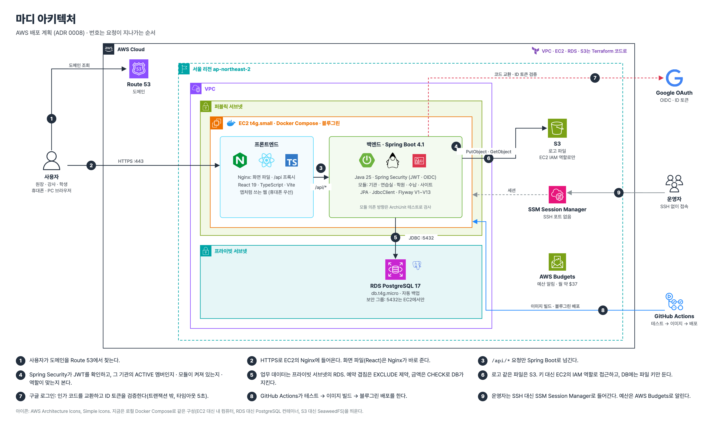](diagrams/aws-architecture.html)

AWS 배포 계획 기준. 번호는 요청이 지나가는 순서. 다시 만들기: [aws-architecture.py](diagrams/aws-architecture.py)

## 1. 시스템 구성 (지금: 로컬 Docker Compose)

[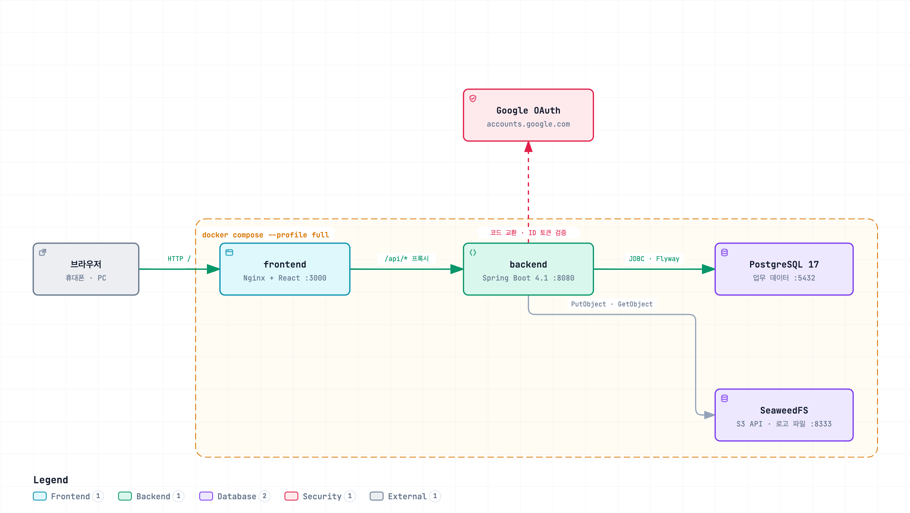](diagrams/system.html)

그림을 누르면 확대·검색·관계 따라가기가 되는 HTML이 열린다(내려받아 브라우저로 열기). 원본: [system.architecture.json](diagrams/system.architecture.json)

| 구성 요소 | 하는 일 | 데이터가 사는 곳 |
|---|---|---|
| frontend | React SPA를 Nginx가 내려 주고, `/api/`만 백엔드로 넘김 | 없음 |
| backend | 인증(JWT), 기관·멤버, 연습실, 학원 관리, 수납, 사이트 | 없음 (상태 없는 서버) |
| postgres | 모든 업무 데이터. 겹침 방지·금액 불변식을 제약으로 지킴 | 볼륨 `postgres-data` |
| storage | 로고 같은 파일. 코드는 S3 API만 알아서 AWS S3로 그대로 바꿀 수 있음 (ADR 0017) | 볼륨 `storage-data` |

## 2. 배포 구성 (계획: AWS, ADR 0008)

[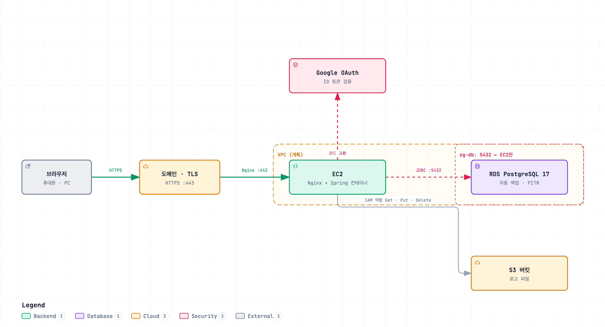](diagrams/deploy.html)

그림을 누르면 확대·검색·관계 따라가기가 되는 HTML이 열린다(내려받아 브라우저로 열기). 원본: [deploy.architecture.json](diagrams/deploy.architecture.json)

- 로컬과 바뀌는 것은 **설정뿐**: DB 주소, 저장소 주소, 키 대신 IAM 역할.
- 배포 전에 할 일: 채팅에 붙여 넣었던 구글 클라이언트 비밀값 교체, Terraform으로 위 구성 만들기.

## 3. 백엔드 모듈과 의존 방향 (ADR 0006, ArchUnit으로 검사)

하나의 Spring 앱 안에서 패키지를 기능 모듈로 나눈 **모듈러 모놀리스**다. 기관마다 모듈(연습실·학원 관리·청구)을 켜고 끈다.

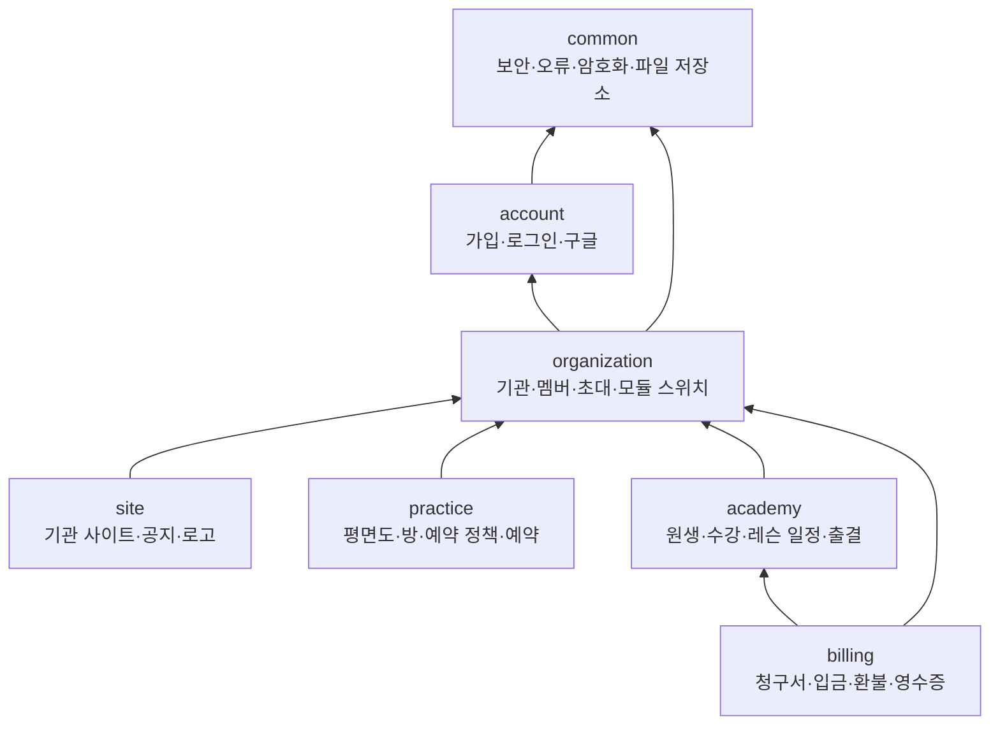

`ModuleDependencyTest`가 막는 것: 연습실 ↔ 학원 관리 서로 의존 금지, 기관은 기능 모듈을 모름, 다른 모듈은 수납을 모름(수납이 수강 이벤트를 받는 쪽), 공통은 어떤 모듈도 모름, `domain`은 `api`·`application`을 모름.

모듈 안 계층:

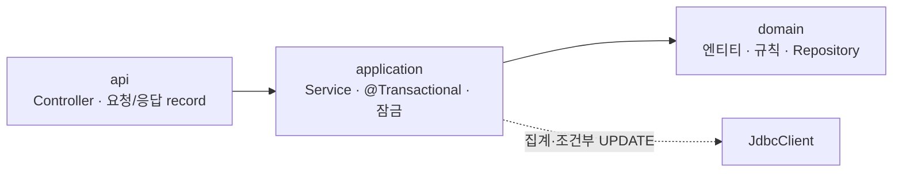

## 4. 요청이 지나가는 길

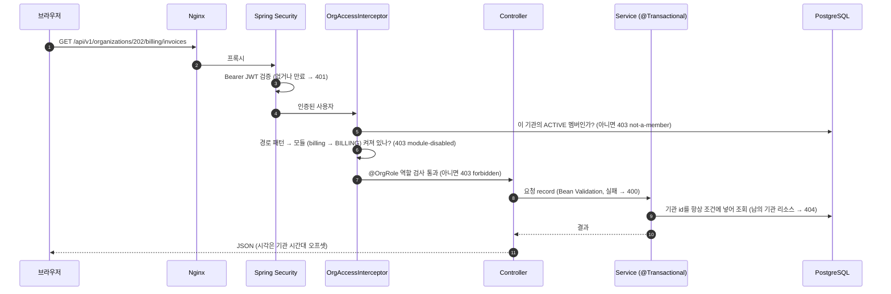

멀티테넌시는 **공유 스키마 + 모든 행에 organization_id**(ADR 0005). 검사 순서 1~5는 [API 명세](../architecture/02-API.md) 맨 앞의 표와 같다.

## 5. 핵심 흐름

### 5.1 연습실 예약: 겹침을 막는 두 겹 (ADR 0010, 실험 0001)

[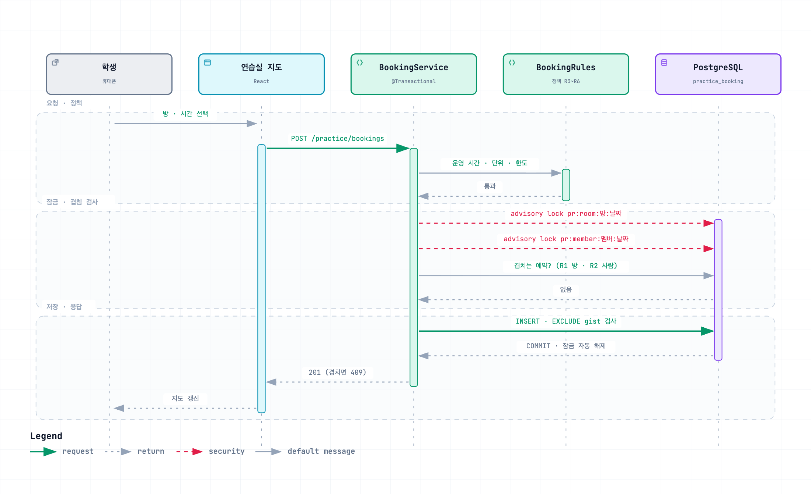](diagrams/booking.html)

그림을 누르면 확대·검색·관계 따라가기가 되는 HTML이 열린다(내려받아 브라우저로 열기). 원본: [booking.sequence.json](diagrams/booking.sequence.json)

실험 0001(같은 방 동시 요청): 아무 조치 없음·`FOR UPDATE`는 **커넥션 풀 수(20)만큼 겹친 행이 저장**됐다(없는 행은 잠글 수 없음 = phantom). advisory lock과 EXCLUDE는 매번 1건.

### 5.2 수강 등록 → 레슨 회차 → 청구서 자동 생성

[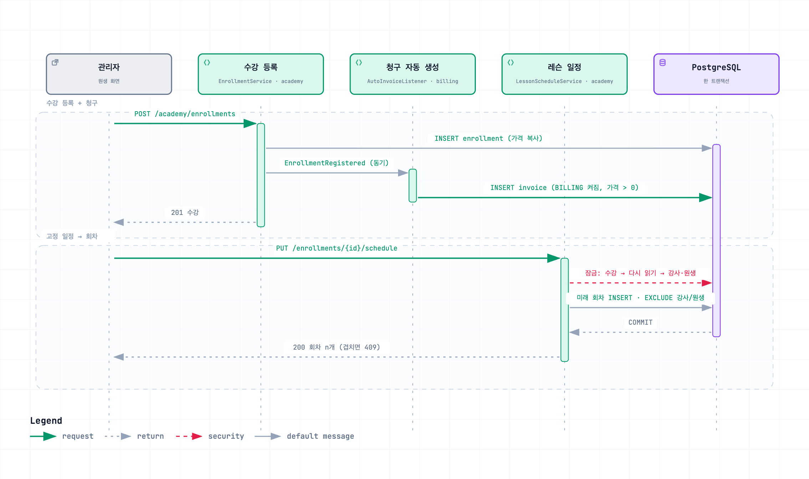](diagrams/enrollment.html)

그림을 누르면 확대·검색·관계 따라가기가 되는 HTML이 열린다(내려받아 브라우저로 열기). 원본: [enrollment.sequence.json](diagrams/enrollment.sequence.json)

academy는 billing을 모른다. 이벤트를 billing이 받는다(그래서 ArchUnit 규칙이 지켜진다). 알림·정산이 붙으면 Outbox로 바꿀 자리.

### 5.3 입금 기록: 두 번 눌러도 한 번, 초과 입금 불가 (ADR 0016)

[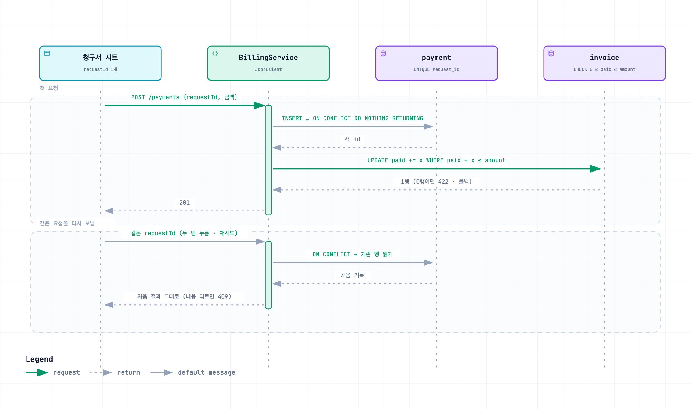](diagrams/payment.html)

그림을 누르면 확대·검색·관계 따라가기가 되는 HTML이 열린다(내려받아 브라우저로 열기). 원본: [payment.sequence.json](diagrams/payment.sequence.json)

판단과 쓰기가 한 문장이라 행 잠금 없이도 동시 입금이 합계를 넘지 못한다.

### 5.4 로고 올리기: DB와 파일 저장소를 같이 맞추기 (ADR 0017)

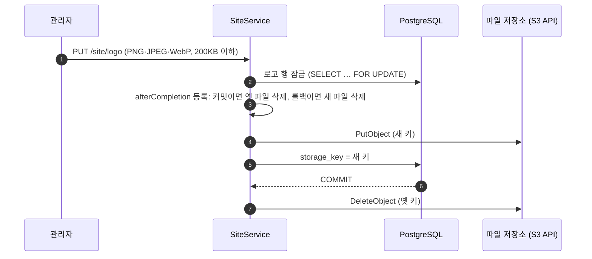

트랜잭션이 실패해도 저장소에 고아 파일이 남지 않고, 성공하면 옛 파일이 정리된다. 공개 로고 읽기는 트랜잭션 밖에서 한다(느린 저장소가 DB 커넥션을 붙잡지 않게).

### 5.5 구글 로그인 (ADR 0013)

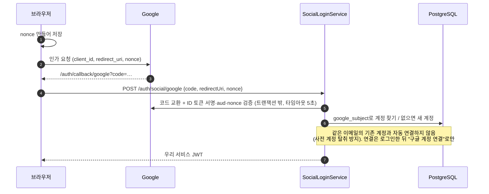

## 6. 데이터 한눈에 (자세한 것은 [ERD](../architecture/01-ERD.md))

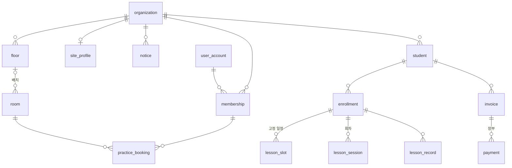
