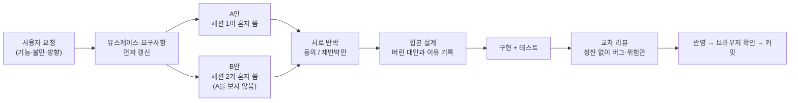

# 작업 방식과 도구

## 1. 두 세션이 따로 설계하고 반박한다

이 프로젝트는 AI 코딩 도구(Claude Code)로 작성했다. 범위와 결정은 작성자가 정하고, 기능마다 이렇게 진행했다.

- 설계는 **보기 전에 각자 쓴다.** 상대 것을 먼저 보면 비슷해져서 반박할 거리가 사라진다.
- 반박은 짧게: "동의" 또는 "재반박 + 근거". 정하지 못한 것은 사용자에게 묻는다.
- 합본에는 **버린 대안과 이유**를 남긴다(ADR 형식).
- 같은 파일을 두 세션이 동시에 고치지 않게 파일 담당을 나눈다.
- 다른 세션이 없을 때는 서브 에이전트를 B로 띄워 같은 방식으로 했다(온보딩).

이 방식으로 잡은 것(일부): 사전 계정 탈취(소셜 로그인), BCrypt 72바이트, 레슨 잠금 키 순서, 온보딩의 모듈 의존 위반 API. → [트러블슈팅](02-트러블슈팅.md)

### 원칙
- **Ponytail(최소 설계):** 유스케이스에 이어지지 않는 테이블·API·화면은 만들지 않는다.
- **문서가 진실:** 요구사항 → 유스케이스 → ADR → ERD·API → 코드 순서. 코드가 바뀌면 문서를 같이 고친다.
- **화면 전에 DESIGN.md:** 색·글자·간격·컴포넌트 규칙을 먼저 정하고 지킨다.
- **검증은 세 겹:** 통합 테스트(Testcontainers, 실제 PostgreSQL) → 실제 브라우저(여러 계정 동시) → 교차 리뷰.

## 2. 쓴 도구

| 분야 | 도구 |
|---|---|
| AI | VS Code의 Claude Code 확장, Claude 세션 2개 (또는 서브 에이전트) |
| 백엔드 | Java 25, Spring Boot 4.1, Spring Security(JWT, OAuth2 Resource Server), JPA/Hibernate, JdbcClient, Flyway, Bean Validation |
| DB | PostgreSQL 17 (EXCLUDE USING gist, advisory lock, 조건부 UPDATE + CHECK) |
| 파일 | AWS SDK v2 S3 API, 로컬은 SeaweedFS |
| 테스트 | JUnit 5, MockMvc, Testcontainers, ArchUnit, vitest |
| 프론트 | React 19, React Router, TypeScript, Vite, oxlint, lucide-react 아이콘 |
| 디자인 | 직접 쓴 [DESIGN.md](../../DESIGN.md)(문서 구조는 Cal.com의 DESIGN.md 참고), Pretendard 글꼴, CSS 토큰 두 파일. UI 라이브러리 없음 |
| 화면 확인 | Playwright(playwright-core) + 설치된 Google Chrome. 스크린샷, 글자 겹침 자동 검사, 끝까지 눌러 보는 흐름 |
| 인프라 | Docker Compose, Nginx, GitHub Actions(백엔드·프론트 job) |
| 실험 | `./gradlew experiment`: 예약 겹침 방지 4가지 방식 비교 → [실험 0001](../experiments/0001-예약-겹침-방지-비교.md) |
