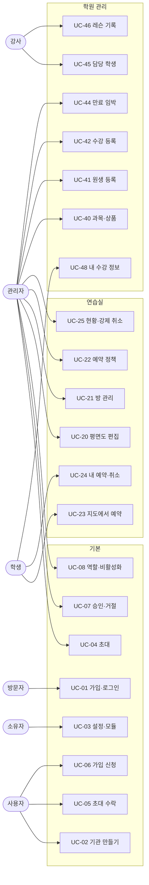

# 유스케이스

| 항목 | 내용 |
|---|---|
| 버전 | 0.2 |
| 작성일 | 2026-10-06 |
| 근거 | [요구사항 정의서](01-요구사항-정의.md) |

이 문서는 MVP 유스케이스를 다룬다. 2차 유스케이스는 2차 시작 전에 추가한다.

---

## 1. 액터

| 액터 | 종류 | 설명 |
|---|---|---|
| 방문자 | 사람 | 아직 로그인하지 않은 사람 |
| 사용자 | 사람 | 로그인했지만 아직 기관에 속하지 않은 사람 |
| 소유자 | 사람 | 기관을 만든 사람. 관리자의 모든 권한을 갖는다 |
| 관리자 | 사람 | 소유자가 운영을 맡긴 사람 |
| 강사 | 사람 | |
| 학생 | 사람 | |
| 시계 | 시스템 | 정해진 시각에 예약을 여는 등 시간에 따라 일어나는 일 |

권한 포함 관계: 소유자 ⊃ 관리자. 강사와 학생은 서로 포함하지 않는다.

## 2. 유스케이스 목록

| ID | 유스케이스 | 주 액터 | 요구사항 | 모듈 |
|---|---|---|---|---|
| UC-01 | 가입하고 로그인한다 | 방문자 | FR-ORG-01 | 기본 |
| UC-02 | 기관을 만든다 | 사용자 | FR-ORG-02 | 기본 |
| UC-03 | 기관 설정과 모듈을 바꾼다 | 소유자 | FR-ORG-03 | 기본 |
| UC-04 | 초대 링크로 멤버를 초대한다 | 관리자 | FR-ORG-04 | 기본 |
| UC-05 | 초대를 수락한다 | 사용자 | FR-ORG-04 | 기본 |
| UC-06 | 가입 코드로 가입을 신청한다 | 사용자 | FR-ORG-04 | 기본 |
| UC-07 | 가입 신청을 승인하거나 거절한다 | 관리자 | FR-ORG-05 | 기본 |
| UC-08 | 멤버의 역할을 바꾸거나 비활성화한다 | 관리자 | FR-ORG-05 | 기본 |
| UC-09 | 기관을 전환한다 | 사용자 | FR-ORG-06 | 기본 |
| UC-10 | 기관 사이트를 꾸민다 (공개 주소·공개·가입 받기는 소유자) | 관리자 | FR-SITE-01·02·04·05 | 사이트 |
| UC-11 | 공지를 쓰고 고정한다 | 관리자 | FR-SITE-03 | 사이트 |
| UC-12 | 공지를 본다 | 멤버 | FR-SITE-03 | 사이트 |
| UC-13 | 공개 소개 페이지를 본다 | 방문자 | FR-SITE-04 | 사이트 |
| UC-14 | 공개 소개 페이지에서 가입을 신청한다 (UC-06의 다른 입구) | 사용자 | FR-SITE-05 | 사이트 |
| UC-20 | 층과 평면도를 편집한다 | 관리자 | FR-PR-01·02 | 연습실 |
| UC-21 | 방 정보를 관리한다 | 관리자 | FR-PR-03 | 연습실 |
| UC-22 | 예약 정책을 정한다 | 관리자 | FR-PR-04 | 연습실 |
| **UC-23** | **지도에서 빈 방을 찾아 예약한다** | 학생 | FR-PR-05·06 | 연습실 |
| UC-24 | 내 예약을 보고 취소한다 | 학생 | FR-PR-07 | 연습실 |
| UC-25 | 전체 예약 현황을 보고 강제 취소한다 | 관리자 | FR-PR-08 | 연습실 |
| UC-40 | 과목과 수업 상품을 관리한다 | 관리자 | FR-AC-01·02 | 학원 관리 |
| UC-41 | 원생을 등록한다 | 관리자 | FR-AC-03 | 학원 관리 |
| **UC-42** | **수강을 등록한다** | 관리자 | FR-AC-04 | 학원 관리 |
| UC-43 | 수강을 연장하거나 바꾼다 | 관리자 | FR-AC-05 | 학원 관리 |
| UC-44 | 원생 목록과 만료 임박 원생을 본다 | 관리자 | FR-AC-06 | 학원 관리 |
| UC-45 | 담당 학생 목록을 본다 | 강사 | FR-AC-07 | 학원 관리 |
| **UC-46** | **레슨 기록을 남긴다** | 강사 | FR-AC-08 | 학원 관리 |
| UC-47 | 원생 상세를 본다 | 관리자, 강사 | FR-AC-09 | 학원 관리 |
| UC-48 | 내 수강 정보와 공개된 레슨 기록을 본다 | 학생 | FR-AC-08 | 학원 관리 |
| UC-49 | 수강의 고정 일정을 정하거나 바꾼다 | 관리자 | FR-AC-12·17 | 학원 관리 |
| UC-50 | 날짜별·주별 레슨 일정과 출결 안 한 회차를 본다 | 관리자, 강사 | FR-AC-13 | 학원 관리 |
| **UC-51** | **출결을 기록한다** | 강사, 관리자 | FR-AC-14 | 학원 관리 |
| UC-52 | 회차나 그날 전체를 휴강하고 보강을 넣는다 | 관리자 | FR-AC-15 | 학원 관리 |
| UC-53 | 내 레슨 일정과 출결을 본다 | 학생 | FR-AC-16 | 학원 관리 |
| UC-60 | 청구서를 만든다 (수강 등록 시 자동 + 직접) | 관리자 | FR-PAY-01 | 수납 |
| UC-61 | 입금·환불을 기록하고 잘못 적은 것을 취소한다 | 관리자 | FR-PAY-02 | 수납 |
| UC-62 | 미납과 기한 지난 청구서를 본다 | 관리자 | FR-PAY-03 | 수납 |
| UC-63 | 영수증을 보여 주거나 인쇄한다 | 관리자 | FR-PAY-04 | 수납 |
| UC-64 | 내 청구서와 납부 내역을 본다 | 학생 | FR-PAY-05 | 수납 |

## 3. 다이어그램

소유자는 관리자의 유스케이스를 모두 할 수 있다. 그림에서는 생략했다.

## 4. 주요 유스케이스 상세

### UC-02 기관을 만든다
| 항목 | 내용 |
|---|---|
| 주 액터 | 사용자 |
| 사전 조건 | 로그인했다 |
| 사후 조건 | 기관이 생기고, 만든 사람이 그 기관의 소유자가 된다 |

**기본 흐름**
1. 사용자가 기관 이름, 유형(학원/학교/기타), 시간대를 입력한다.
2. 사용자가 쓸 모듈을 고른다. 기본값은 유형에 따라 다르다. 학원은 연습실과 학원 관리를, 학교는 연습실만 켠다.
3. 시스템이 기관을 만들고, 사용자를 소유자로 등록하고, 가입 코드를 만든다.
4. 시스템이 새 기관의 첫 화면으로 보낸다.

**대안 흐름**
- 2a. 연습실 모듈을 켜면 시스템이 기본 예약 정책을 함께 만든다. 정책은 UC-22에서 바꾼다.

---

### UC-06 가입 코드로 가입을 신청한다 / UC-07 승인한다
| 항목 | 내용 |
|---|---|
| 주 액터 | 사용자 (신청), 관리자 (승인) |
| 사전 조건 | 신청자는 로그인했고, 관리자에게서 가입 코드를 받았다 |
| 사후 조건 | 승인되면 신청자가 학생으로 기관에 속한다 |

**기본 흐름**
1. 사용자가 가입 코드와 기관이 요구하는 정보(예: 학번, 전공)를 입력한다.
2. 시스템이 코드에 맞는 기관을 찾아 **대기** 상태의 신청을 만든다.
3. 관리자가 대기 목록에서 신청을 확인하고 승인한다.
4. 시스템이 신청자를 학생으로 등록한다.

**대안 흐름**
- 2a. 코드가 틀렸거나 기관이 코드 가입을 껐다 → 거절한다.
- 2b. 이미 그 기관의 멤버이거나 대기 중인 신청이 있다 → 거절한다.
- 3a. 관리자가 거절한다 → 신청이 거절 상태가 된다. 신청자는 다시 신청할 수 있다.

**규칙**
- 가입 코드는 관리자가 언제든 새로 만들 수 있다. 새로 만들면 이전 코드는 무효가 된다.
- 대기 중인 사용자는 그 기관의 어떤 데이터도 볼 수 없다.

---

### UC-20 층과 평면도를 편집한다
| 항목 | 내용 |
|---|---|
| 주 액터 | 관리자 |
| 사전 조건 | 연습실 모듈이 켜져 있다 |
| 사후 조건 | 학생 화면의 지도가 바뀐 평면도로 보인다 |

**기본 흐름**
1. 관리자가 층을 고른다. 층이 없으면 새로 만든다.
2. 관리자가 격자 위에서 벽과 복도를 칠하거나 지운다.
3. 관리자가 방을 격자 위의 자리에 배치하고 이름을 붙인다.
4. 관리자가 저장한다.
5. 시스템이 평면도를 저장하고 버전을 올린다.

**대안 흐름**
- 3a. 앞으로의 예약이 있는 방을 평면도에서 빼려고 한다 → 거절하고 그 예약 목록을 보여 준다. 관리자가 예약을 먼저 취소한다.
- 5a. 다른 관리자가 그사이에 같은 층을 먼저 저장했다 → 시스템이 저장을 거절하고 새 버전을 불러오라고 알린다. 덮어쓰지 않는다.

**규칙**
- 저장하지 않고 나가면 바꾼 내용은 사라진다.
- 한 칸에 방은 하나만 놓인다.

---

### UC-23 지도에서 빈 방을 찾아 예약한다 ★
| 항목 | 내용 |
|---|---|
| 주 액터 | 학생 |
| 사전 조건 | 연습실 모듈이 켜져 있고, 학생은 기관의 활성 멤버다 |
| 사후 조건 | 예약이 확정되고 내 예약 목록에 보인다 |

**기본 흐름**
1. 학생이 층과 날짜, 시각을 고른다.
2. 시스템이 그 층의 평면도를 보여 주고, 방마다 그 시각에 **비어 있음 / 예약됨 / 사용 불가**를 색으로 표시한다.
3. 학생이 빈 방을 누른다.
4. 시스템이 그 방의 그날 시간표를 보여 준다. 시간 단위로 나뉘어 있고, 예약된 칸과 고를 수 없는 칸이 표시된다.
5. 학생이 시작과 끝 칸을 고르고 예약을 요청한다.
6. 시스템이 아래 규칙을 모두 확인하고 예약을 확정한다.
7. 시스템이 확정된 예약을 보여 준다.

**대안 흐름**
- 6a. 그사이에 다른 사람이 같은 방의 겹치는 시간을 먼저 예약했다 → "방금 다른 사람이 예약했다"고 알리고 시간표를 새로 보여 준다.
- 6b. 내가 같은 시간에 다른 방을 이미 예약했다 → 거절하고 그 예약을 알려 준다.
- 6c. 정책을 어겼다 (최대 연속, 하루 최대, 운영 시간 밖, 아직 열리지 않은 날짜) → 어느 규칙인지 알려 주고 거절한다.
- 6d. 방이 점검 중이다 → 거절한다.

**규칙**
| # | 규칙 | 위반 시 |
|---|---|---|
| R1 | 같은 방의 유효한 예약끼리 시간이 겹치지 않는다 | 충돌 |
| R2 | 같은 사람의 유효한 예약끼리 시간이 겹치지 않는다 (방이 달라도) | 충돌 |
| R3 | 1회 이용 시간은 정책의 최대 연속 이하다 | 정책 위반 |
| R4 | 같은 날 그 사람의 이용 합계는 정책의 하루 최대 이하다 | 정책 위반 |
| R5 | 시작과 끝은 시간 단위에 맞고, 운영 시간 안이고, 과거가 아니다 | 정책 위반 |
| R6 | 날짜가 예약 오픈 범위 안이다 | 정책 위반 |

- R1, R2는 기관 안에서 따진다. R1, R2, R4는 **동시 요청에서도** 지켜져야 한다. 두 요청이 각자 검사를 통과한 뒤 둘 다 저장되면 안 된다.
- 시간 구간은 시작은 포함하고 끝은 포함하지 않는다. 16:00~17:00과 17:00~18:00은 겹치지 않는다.

---

### UC-42 수강을 등록한다 ★
| 항목 | 내용 |
|---|---|
| 주 액터 | 관리자 |
| 사전 조건 | 학원 관리 모듈이 켜져 있다. 원생, 상품, 강사가 등록되어 있다 |
| 사후 조건 | 수강 중 상태의 수강이 생긴다. 담당 강사의 학생 목록에 원생이 보인다 |

**기본 흐름**
1. 관리자가 원생을 고른다.
2. 관리자가 상품과 담당 강사, 시작일을 고른다.
3. 시스템이 종료일(기간권) 또는 총 회차(횟수권)를 계산해 보여 준다.
4. 관리자가 확인하고 저장한다.
5. 시스템이 수강을 만든다.

**대안 흐름**
- 4a. 비활성화된 강사나 원생이다 → 거절한다.

**규칙**
- 수강 상태: 수강 중 → 일시정지 ↔ 수강 중 → 종료. 수강 중 또는 일시정지 → 환불. 종료와 환불에서는 다른 상태로 가지 않는다.
- 기간권의 종료일은 일시정지한 기간만큼 늘어난다. 다시 시작할 때 계산한다.
- 상품의 가격을 나중에 바꿔도 이미 등록된 수강의 금액은 바뀌지 않는다. 등록할 때 금액을 수강에 복사한다.

---

### UC-46 레슨 기록을 남긴다 ★
| 항목 | 내용 |
|---|---|
| 주 액터 | 강사 |
| 사전 조건 | 학원 관리 모듈이 켜져 있고, 학생이 그 강사의 수강 중인 담당 학생이다 |
| 사후 조건 | 원생 상세의 타임라인에 기록이 보인다 |

**기본 흐름**
1. 강사가 담당 학생 목록에서 학생을 고른다.
2. 강사가 날짜, 진도, 숙제, 메모를 쓰고 학생 공개 여부를 정한다.
3. 시스템이 기록을 저장한다.

**대안 흐름**
- 1a. 담당이 아닌 학생이다 → 거절한다. 담당이 바뀐 뒤에도 예전 기록은 쓴 강사가 볼 수 있다.
- 2a. 강사가 나중에 기록을 고치거나 지운다 → 쓴 사람만 할 수 있다.

**규칙**
- 소유자와 관리자는 모든 기록을 본다. 학생은 공개된 기록만 본다.

### UC-13 공개 소개 페이지를 본다 / UC-14 가입을 신청한다
**사전 조건** 소유자가 공개를 켜고 주소를 정했다.

**기본 흐름**
1. 방문자가 `/s/주소`를 연다. 로그인은 필요 없다.
2. 기관 이름·로고·소개·연락처·운영 안내와 외부 공개 공지(최근 10개)가 보인다. 기관 색이 적용된다.
3. "가입 신청 받기"가 켜져 있으면 아래에 "가입 신청" 버튼이 있다. 누르면 로그인(또는 가입)을 거쳐 신청 화면으로 간다.
4. 신청 항목을 채워 보낸다. 가입 코드 신청(UC-06)과 같은 대기 상태가 되고, 관리자가 승인한다(UC-07).

**대안 흐름**
- 1a. 없는 주소이거나 공개가 꺼져 있다 → 같은 "찾을 수 없어요" 화면. 둘을 구분하지 않는다.
- 4a. 그 사이 소유자가 가입 받기를 껐다 → 신청이 거절되고 같은 "찾을 수 없어요"가 된다.

**규칙**
- 공개 페이지는 정해 둔 항목만 보여 준다. 멤버 수, 방·평면도, 예약 정책, 가입 코드, 소유자 이름은 보여 주지 않는다.
- 가입 코드는 공개하지 않는다. 공개 페이지 신청은 주소로 기관을 찾는다.

### UC-51 출결을 기록한다 ★
**사전 조건** 수강에 고정 일정이 있어 회차가 만들어져 있다.

**기본 흐름**
1. 강사가 홈의 "오늘 레슨"에서 회차를 누른다.
2. 출석 / 결석 / 사전 결석 중 하나와 메모(선택)를 남긴다.
3. 횟수권이면 출석·결석만 남은 회차에서 빠진다. 사전 결석이면 맨 뒤에 회차가 하나 이어 붙는다.

**대안 흐름**
- 2a. 회차가 시작하기 전에 출석·결석을 누른다 → 거절. 사전 결석은 된다.
- 2b. 남의 회차다 → 거절(관리자는 모든 회차).
- 3a. 이어 붙일 자리가 강사·원생의 다른 회차와 겹친다 → 겹치지 않는 다음 슬롯에 붙인다. 출결 저장은 실패하지 않는다.
- 4. 출결을 잊은 지난 회차는 홈에 "출결 안 한 레슨 n건"으로 모인다. 자동으로 출석 처리하지 않는다(차감과 직결된다).

**규칙**
- 횟수권: 출석 + 결석 + 앞으로의 회차(출결 안 한 지난 회차, 보강 포함) = 총 회차.
- 출결한 회차는 일정을 바꾸거나 수강을 멈춰도 지워지지 않는다.

## 5. 요구사항 추적

| 요구사항 | 유스케이스 |
|---|---|
| FR-ORG-01~06 | UC-01~09 |
| FR-SITE-01~05 | UC-10~14 |
| FR-PR-01~08 | UC-20~26 |
| FR-AC-01~09 | UC-40~48 |
| FR-AC-12~17 | UC-49~53 |
| FR-PAY-01~05 | UC-60~64 |
| NFR-01 | UC-23 규칙 R1·R2·R4 |
| NFR-03 | 모든 유스케이스 (다른 기관 데이터 접근 불가) |
